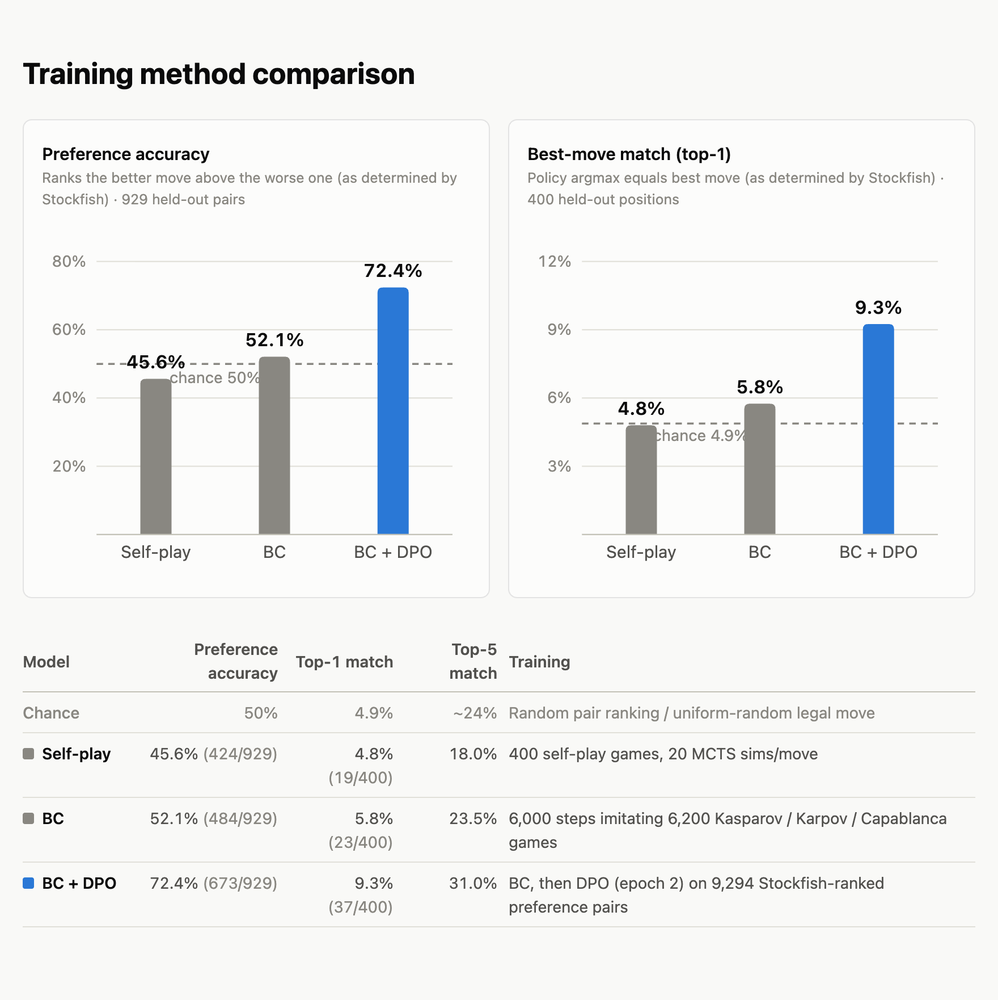

# MCTS Chess

This is a side project inspired by DeepMind's [AlphaZero paper](https://arxiv.org/abs/1712.01815) (Silver et al., 2017). It is a "naive" implementation of the MCTS algorithm described in the paper with some key differences noted below.

## Architecture

Each position is represented as a series of 18 eight by eight feature planes. Each feature plane represents the locations on the board of various types of piece (e.g. One feature plane for black rook locations, one feature plane for white pawn locations, etc.), with special feature planes for game rules such as whose move it is and castling rights. *Note: I used fewer feature planes than the DeepMind implementation because I did not think it was necessary to perfectly capture some draw-forcing rules such as threefold repetition or 50 moves with no capture or pawn move.*

After encoding, this yields 64 18-dimensional tokens, or one token per square of the board.

*Note: Unlike the original DeepMind approach, which used a residual convolutional network, this implementation uses a transformer architecture.*

The default config is 4 layers, 2 heads per layer, and hidden dimension 128 (~20 million parameters). I used fairly small defaults in order to be able to run this locally on a CPU.

Each layer contains:
1. a LayerNorm
2. a multi-head self-attention sublayer
3. another LayerNorm
4. A feed-forward sublayer with hidden dimension 512 and ReLU

There is a positional embedding matrix whose weights are initialized randomly and then learned through training.

## Output

The network has three output heads: policy, value, and material. The heads are trained by gradient descent according to the loss formula:

```
total_loss = policy_loss + value_loss + 0.1 * material_loss
```

The policy head outputs logits for each of the 4,672 possible moves in a chess game. policy_loss is the cross-entropy between the logit vector and the MCTS algorithm's visit count distribution across the possible moves (or, in the case of the master games during the behavioral cloning phase, a one-hot of the actual move played).

The value head outputs the network's estimate of V, or who it thinks is winning. Actual V is the game outcome z ∈ {-1, 0, +1}. V feeds ultimately into the PUCT score calculated by the MCTS algorithm to determine which move to try next, so it is a key driver of how accurate the policy is. value_loss is the mean squared error.

The material head is the network's estimate of the material balance of a given position, which can easily be calculated deterministically by just adding up what white and black pieces are on the board. *Note: The material head was not in the original AlphaZero paper. I added the head in the hope that it would give the network some signal about the real position early in the training, since the network is often unable to achieve checkmates that are right under its nose and so the signal for V is relatively weak. The material head does not directly play into the policy determination of the next move, but the idea of training it is to teach the network something about the game that is more immediately accessible than a checkmate buried deep in a game tree.*

## Training Data / Alternate Approaches

In DeepMind's original setup, the data consists entirely of self-play games, so that the network would not learn human patterns only to unlearn them later. However, this is a slow process because the network plays almost randomly early in training, and hence even huge advantages do not lead reliably to checkmate. This leads to the MCTS algorithm delivering a sparse signal and the policy and V heads only very slowly converging on play that looks something other than random.

In order to speed things up for this small implementation, I introduced some alternate training approaches: (i) behavioral cloning with grandmaster games instead of self-play games and (ii) DPO where the policy head's best and worst responses (as determined by Stockfish) from a given master game position are used as preference pairs to train the network.

## Results

On this small scale, none of the training approaches led to strong play in the absolute sense: no checkpoint was able to beat Stockfish even at skill level 0, even with running 2000 tree searches per position. In particular, self-play led to outcomes that were no better than chance, probably due to the fact that many rounds of training are required for the influence of decisive positions to trickle down to the V and policy heads.

Behavioral cloning and DPO did create meaningful improvement in the ability of the networks to distinguish relatively better moves from worse ones and also the probability of finding the overall best move in the position (as determined by Stockfish on its strongest setting). These metrics are shown in the below chart.

<picture>
  <source media="(prefers-color-scheme: dark)" srcset="dpo/regime_comparison_dark.png">
  
</picture>

## Running the code

Install dependencies:

```bash
pip install -r requirements.txt
brew install stockfish
```

Stockfish is only needed for evaluation and DPO pair generation, not for training. On Linux, install it with your package manager instead of Homebrew.

Build the expert-games buffer from PGN files:

```bash
python bc/prepare_expert_games.py --pgn-file bc/Kasparov.pgn bc/Karpov.pgn bc/Capablanca.pgn --train-games 6200 --eval-games 20 --prefix top_players
```

Conduct training on master games:

```bash
python train.py --load-buffer top_players_train.pkl --cycles 10 --train-steps-per-cycle 1000 --batch-size 256 --learning-rate 2e-4 --d-model 128 --num-blocks 4 --num-heads 2 --d-policy 64 --checkpoint-interval 2 --log-training-steps
```

Create self-play games and train on them:

```bash
python train.py --cycles 10 --train-steps-per-cycle 1000 --batch-size 256 --learning-rate 2e-4 --d-model 128 --num-blocks 4 --num-heads 2 --d-policy 64 --checkpoint-interval 2 --log-training-steps
```

Generate DPO preference pairs from master games and fine-tune a checkpoint on them (pass `--stockfish-path` if Stockfish is not at `/opt/homebrew/bin/stockfish`):

```bash
python dpo/generate_dpo_pairs.py --pgn-file bc/Kasparov.pgn --num-games 100 --model <checkpoint> --output dpo_pairs.pkl
python dpo/train_dpo.py --pairs dpo_pairs.pkl --model <checkpoint> --output model_dpo.pt
```

Compare checkpoints on held-out preference pairs (the metrics shown in the chart above):

```bash
python dpo/eval_preference_accuracy.py --pairs dpo_pairs.pkl --checkpoint bc=<checkpoint> --checkpoint dpo=model_dpo.pt
```

Test a checkpoint in a head-to-head game against Stockfish:

```bash
python tests/test_elo.py --checkpoint <checkpoint> --simulations 2000 --skill-level 1 --num-games 1
```

Play a game against a checkpoint in the browser (human vs. network):

```bash
python play.py --checkpoint <checkpoint>
python play.py --checkpoint <checkpoint> --color black --simulations 200
```
